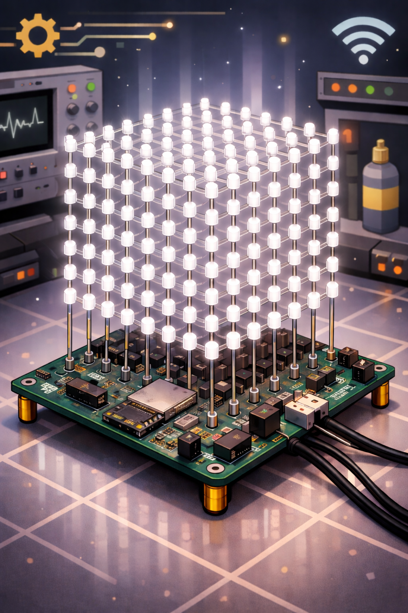

# 8×8×8 LED Cube with Custom ESP32 Control PCB

Portfolio-grade embedded systems project: a fully documented 8×8×8 LED cube built around a custom single-board hardware design, ESP32-based control, and structured engineering documentation from requirements to validation.



---

## Project Overview

This project is an **8×8×8 LED cube (512 LEDs)** designed as a complete engineering case study rather than only a visual demo.  
The repository documents the full process: concept definition, architecture decisions, hardware design, firmware development, bring-up, validation, and final presentation.

The current direction is:

- **Cube size:** 8×8×8
- **Controller:** ESP32
- **Target outcome:** a strong public GitHub project

---

## Why this project is interesting

This repository is meant to show more than a blinking LED project. It demonstrates:

- system-level design thinking
- custom PCB development
- embedded firmware structure
- hardware/software integration
- troubleshooting and validation
- professional documentation and revision history

---

## Planned Features

- 8×8×8 LED cube with 512 LEDs
- Custom main control PCB
- ESP32-based control and firmware
- LED multiplexing / scanning architecture
- Animation engine for 3D effects
- Structured power distribution design
- Bring-up and verification documentation
- Demo media and final validation results

---

## Current Status

- [x] Project concept selected
- [x] Portfolio-oriented approach defined
- [x] Repository structure started
- [ ] System requirements documented
- [ ] Architecture and block diagrams completed
- [ ] Schematic completed
- [ ] PCB layout completed
- [ ] Manufacturing files exported
- [ ] Hardware assembled
- [ ] Firmware baseline running
- [ ] First full-cube animation demo
- [ ] Validation and final release

---

## Repository Structure

```text
docs/        Project documentation, requirements, planning, validation
hardware/    Schematics, PCB files, exports, manufacturing outputs
firmware/    ESP32 firmware source code and related tools
media/       Photos, renders, diagrams, GIFs, demo videos