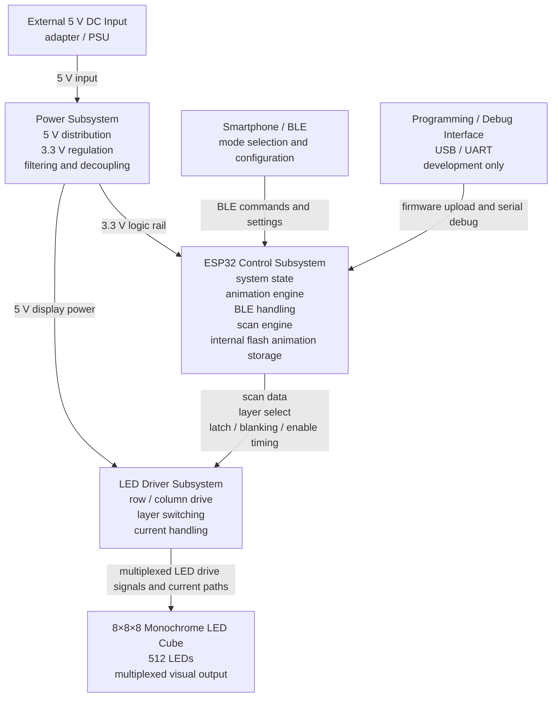

# System Architecture — 8×8×8 LED Cube

## 1. Purpose

This document defines the high-level system architecture of the 8×8×8 LED Cube project.

It identifies the major subsystems, the interfaces between them, and the main responsibilities assigned to each subsystem. The document is intended to guide hardware design, firmware structure, bring-up, and later verification.

---

## 2. Architecture Baseline

This architecture follows the locked project decisions:

- **Main controller:** ESP32 module on the custom PCB
- **Primary user control:** smartphone over BLE
- **Display type:** monochrome 8×8×8 LED cube
- **Animation storage:** ESP32 internal flash only
- **Main power input:** 5 V DC
- **Power target:** external adapter sized for the cube and driver load
- **Hardware platform:** one main custom PCB
- **Display method:** multiplexed scanning through a dedicated driver stage

These points are architectural constraints for revision 1.

---

## 3. System Overview

The project is a single-board embedded system that receives external 5 V power, accepts user commands over BLE, generates animation data in firmware, converts that data into scan timing and drive patterns, and displays the result on a monochrome 8×8×8 LED cube.

At top level, the system is divided into five main subsystems:

1. **Power subsystem**
2. **ESP32 control subsystem**
3. **LED driver subsystem**
4. **8×8×8 LED cube subsystem**
5. **BLE user interface subsystem**

A separate **programming/debug interface** is included for firmware upload and development access, but it is not the primary end-user interface.

---

## 4. Top-Level Architecture Diagram

**Figure — High-level system architecture.** The power subsystem receives external 5 V input and provides logic and display power paths. The ESP32 is the central control block and handles BLE communication, animation logic, and scan generation. The LED driver subsystem converts ESP32 control signals into multiplexed drive signals for the monochrome 8×8×8 LED cube. Programming/debug access is a development-only interface to the ESP32.

---

## 5. Major Subsystems and Responsibilities

### 5.1 Power Subsystem

The power subsystem is responsible for electrical supply handling and rail distribution.

**Responsibilities**
- receive the external 5 V DC input
- distribute 5 V power to the LED driver stage
- provide local decoupling and bulk capacitance
- limit the effect of display-current transients on logic stability
- support PCB-level separation of noisy display-current paths and sensitive logic paths

**Boundary**
The power subsystem owns supply quality and distribution. It does not own control logic, animation logic, or communication.

### 5.2 ESP32 Control Subsystem

The ESP32 control subsystem is the central logic and coordination block.

**Responsibilities**
- run the main firmware
- maintain system state and operating mode
- store animations in internal flash memory
- manage the logical cube image or voxel model
- generate scan timing and output patterns
- control brightness through firmware timing strategy
- manage BLE communication
- expose development-time programming and debug access
- coordinate the LED driver stage

**Suggested internal firmware layers**
- hardware abstraction / low-level I/O
- scan engine
- display mapping layer
- animation engine
- BLE command handling
- diagnostics and test patterns

**Boundary**
The ESP32 owns system logic, timing, communication, and animation behavior. It must not directly carry the high LED switching current required by the cube.

### 5.3 LED Driver Subsystem

The LED driver subsystem is the electrical interface between the ESP32 and the LED cube.

**Responsibilities**
- receive logic-level control signals from the ESP32
- switch the active layer in the multiplexing sequence
- drive row/column line states for the active layer
- handle LED current switching outside the ESP32 GPIO pins
- support clean latching, blanking, and enable timing during refresh
- isolate the controller from direct high-current LED loading

**Boundary**
The LED driver subsystem owns electrical switching and current handling. It does not decide which animation to show.

### 5.4 LED Cube Subsystem

The LED cube subsystem is the physical 8×8×8 monochrome LED structure.

**Responsibilities**
- act as the final visual output of the system
- convert multiplexed electrical drive into a visible 3D image
- display one active layer at a time
- rely on persistence of vision for a stable full-frame image

**Boundary**
The cube is treated as the passive visual load in the system architecture. It does not contain control logic.

### 5.5 BLE User Interface Subsystem

The BLE user interface subsystem is the primary end-user control path for revision 1.

**Responsibilities**
- provide wireless control from a smartphone
- carry mode selection commands
- carry animation selection commands
- carry parameter changes such as brightness or speed, if implemented
- keep user control separate from the time-critical scan path

**Boundary**
BLE provides command and configuration input only. It does not directly drive the LEDs or control scan timing.

### 5.6 Programming / Debug Interface

This development-only interface supports implementation and bring-up.

**Responsibilities**
- firmware upload
- serial logging or diagnostics
- development-time testing and troubleshooting
- maintenance and recovery access

**Boundary**
This interface is not the primary user interface in revision 1.

---

## 6. Interface Definitions

### IF-01 External Power Interface
**From:** external adapter / PSU  
**To:** power subsystem

**Purpose**
Provide the main electrical input for the complete system.

**Carries**
- 5 V power
- ground / return

### IF-02 BLE Control Interface
**From:** smartphone / BLE client  
**To:** ESP32 control subsystem

**Purpose**
Carry end-user commands and settings wirelessly.

**Carries**
- mode changes
- animation selection
- parameter updates
- start/stop or similar user commands

**Characteristics**
- low-bandwidth control/configuration path
- not timing-critical for refresh
- logically separate from display scanning

### IF-03 Programming / Debug Interface
**From:** PC or development tool  
**To:** ESP32 control subsystem

**Purpose**
Support firmware loading, debugging, and bring-up.

**Carries**
- firmware upload data
- serial debug/logging data
- development test access

### IF-04 Scan Control Interface
**From:** ESP32 control subsystem  
**To:** LED driver subsystem

**Purpose**
Translate logical cube image data into electrical drive commands.

**Carries**
- row/column data
- layer-select control
- latch signals
- blanking / enable timing
- refresh sequencing information

**Characteristics**
- timing-critical
- must support stable, flicker-free display refresh
- must support brightness control strategy

### IF-05 Drive Interface
**From:** LED driver subsystem  
**To:** LED cube subsystem

**Purpose**
Apply the switched electrical signals that create the visible output.

**Carries**
- active layer enable
- row/column drive states
- multiplexed LED current paths

---

## 7. System Operation

At high level, the system operates as follows:

1. External 5 V power is applied to the PCB.
2. The power subsystem establishes stable logic and display supply paths.
3. The ESP32 boots, initializes peripherals, and loads the default operating state.
4. A smartphone sends commands or settings over BLE.
5. The ESP32 updates the active mode and internal cube model.
6. The scan engine extracts one display layer at a time.
7. The LED driver subsystem applies the correct row/column pattern and layer switching.
8. The cube displays each layer for a short time window.
9. The process repeats fast enough to produce a stable visible image.

This results in two concurrent architectural paths:

- a **slow control path** for BLE commands and mode changes
- a **fast refresh path** for continuous multiplexed display scanning

These two paths should remain separated in firmware structure.

---

## 8. Firmware Architecture View

The firmware should be structured in layers rather than written as one monolithic application.

### 8.1 Hardware abstraction layer
Responsible for GPIO, timing resources, and low-level peripheral control.

### 8.2 Display engine
Responsible for converting the logical cube state into scan-ready output data.

### 8.3 Animation engine
Responsible for visual patterns, timing of effects, and mode-specific behavior.

### 8.4 BLE communication layer
Responsible for receiving external commands and exposing configuration hooks.

### 8.5 Diagnostics and test services
Responsible for bring-up patterns, startup checks, and development-time diagnostics.

A practical runtime structure is:
- a fast periodic refresh task or interrupt-driven scan mechanism
- a main loop or scheduled tasks for animation updates and BLE handling
- explicit test/diagnostic modes for bring-up and validation

---

## 9. Architectural Implications

The architecture implies the following implementation rules:

- firmware should remain layered and maintainable
- scan timing must be treated as time-critical
- BLE handling must not disturb stable refresh timing
- power layout must separate noisy display-current paths from logic-sensitive paths
- the driver stage must absorb LED switching demands instead of the ESP32 pins
- no external animation memory is included in revision 1
- USB/UART remains a development interface, not the main user control path

---

## 10. Out of Scope for Revision 1

The following are outside the baseline architecture unless a later revision formally changes the project decisions:

- RGB cube architecture
- external animation memory
- Wi-Fi as the main control path
- USB as the primary end-user control interface
- battery-powered architecture
- modular multi-PCB architecture
- audio-reactive or microphone-based features as baseline requirements

---

## 11. Verification-Relevant Architecture Points

This architecture creates the following direct verification targets:

- stable 5 V rail under representative display load
- reliable ESP32 startup, programming, and debug access
- correct BLE command/control path
- correct layer-by-layer scanning behavior
- correct driver-to-cube electrical mapping
- flicker-free display at intended operating modes
- no visible refresh instability caused by BLE traffic or mode changes

These points should later map into bring-up and validation documents.

---

## 12. Summary

The project is architected as a single-board ESP32-controlled monochrome 8×8×8 LED cube with a dedicated driver stage and smartphone BLE control.

The main architectural elements are:

1. power subsystem
2. ESP32 control subsystem
3. LED driver subsystem
4. LED cube subsystem
5. BLE user interface subsystem

The key interfaces are:

- external 5 V power input
- BLE command/control input to the ESP32
- programming/debug access to the ESP32
- scan control from the ESP32 to the driver stage
- electrical drive from the driver stage to the cube

This high-level architecture matches the locked project decisions and gives a clear structure for schematic design, PCB implementation, firmware development, and validation.
