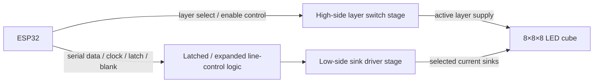

# LED Driver Topology

## 1. Purpose

This document describes how the 8×8×8 monochrome LED cube is electrically driven in revision 1. It explains:

- how the cube is divided into layers and line channels
- which side of the cube is switched on the high side and which side is switched on the low side
- how multiplexing works
- why this topology was selected for the project baseline

This document is the topology-level description for the hardware design. Exact part numbers and final net names belong to the schematic and BOM.

---

## 2. Topology Summary

Revision 1 uses a **dedicated driver stage** between the ESP32 and the LED cube.

The selected driving approach is:

- **one active layer at a time**
- **high-side switching for layer enable**
- **low-side switching for the row/column line pattern of the active layer**
- **time-multiplexed refresh across all 8 layers**

At system level, the display is treated as:

- **8 layers**
- **64 LED positions per active layer**
- **512 LEDs total**

A full 3D image is not driven continuously. Instead, firmware refreshes the cube layer-by-layer fast enough that the viewer perceives a stable volume image.

---

## 3. Electrical Organization of the Cube

The cube is organized into two electrical dimensions:

### 3.1 Layer selection

Each horizontal slice of the cube is treated as one **layer**.

Only **one layer** is enabled at a time.  
The active layer is connected to the supply through a dedicated **high-side switching element**.

### 3.2 Line control inside the active layer

Within the selected layer, the required LED pattern is created by the line-driver stage.

For the active layer:

- LEDs that should turn on are given a valid current path
- LEDs that should stay off do not receive a valid current path

In practice, this means the active layer is selected first, and then the row/column line states for that layer determine which of the 64 voxel positions are illuminated during that scan slot.

---

## 4. High-Side / Low-Side Approach

### 4.1 High-side layer control

The **layer side** of the cube is switched on the **high side**.

That means:

- each layer has its own dedicated high-side switch
- only one layer switch is turned on at a time
- the enabled layer provides the positive supply path for that layer during its scan window

### Switching elements used on the high side

At topology level, the layer-enable stage uses:

- **one high-side switching device per layer**
- implemented as a **P-channel MOSFET or equivalent high-side transistor stage**

The key requirement is that the high-side element for a layer must carry the **combined instantaneous current** of all LEDs that may be on in that layer during its active time slot.

### 4.2 Low-side line control

The row/column pattern is switched on the **low side**.

That means:

- the line-driver stage sinks current for the LED positions that should turn on in the currently selected layer
- the ESP32 does not carry LED load current directly
- the low-side stage creates the per-position on/off pattern for the active slice

### Switching elements used on the low side

At topology level, the line-driving stage uses:

- **sink-capable low-side driver channels**
- implemented with **transistor-driver outputs, transistor arrays, or sink-capable driver registers**

These low-side elements are controlled by logic signals from the ESP32, typically through a latched or shift-register-based output stage so the required number of channels can be generated without consuming excessive MCU pins.

---

## 5. Functional Signal Flow

The intended signal chain is:

The ESP32 provides only **logic-level control signals**.  
The driver stage provides the actual electrical switching needed by the cube.

---

## 6. Multiplexing Strategy

### 6.1 Basic scan method

The cube is refreshed by scanning one layer at a time.

A typical refresh cycle is:

1. blank the display outputs to avoid ghosting during update
2. load the next row/column pattern into the line-driver stage
3. disable the previous layer
4. enable the new target layer
5. hold that layer active for a short dwell time
6. repeat the process for the next layer
7. cycle through all 8 layers continuously

After all 8 layers have been displayed once, one full display frame has been refreshed.

### 6.2 Why multiplexing is required

Driving all 512 LEDs as continuously powered outputs would create excessive:

- GPIO count requirements
- driver complexity
- routing complexity
- simultaneous current demand

Multiplexing reduces the problem to:

- **8 layer-enable channels**
- **64 active line channels for the currently selected slice**
- firmware-controlled scan timing instead of 512 always-driven outputs

### 6.3 Brightness control

Brightness is controlled in firmware by timing, not by directly varying supply voltage.

Possible timing-based control methods include:

- changing per-layer dwell time
- applying frame-level brightness scaling
- applying PWM or bit-plane style brightness scheduling if later implemented

This keeps the hardware topology simpler while still allowing visual brightness control.

---

## 7. Current Path Description

For one LED to turn on, all of the following must be true at the same time:

- the correct **layer high-side switch** is enabled
- the corresponding **low-side line** is driven to its active sink state
- the LED is oriented so that current can flow from the active layer side to the active low-side line

The instantaneous current path is therefore:

**5 V rail → active high-side layer switch → selected LED in active layer → active low-side sink channel → ground**

If either the layer is not enabled or the low-side sink is not active, that LED remains off.

---

## 8. Current-Limiting and Protection Intent

The LED drive topology assumes that LED current is limited by the hardware design, not by the ESP32.

That means:

- current limiting belongs in the driver path
- switching devices are sized for their expected current and thermal load
- the ESP32 only controls the switching logic
- safe default states are required so unintended LED turn-on does not occur during reset or startup

The exact resistor placement and exact component values are schematic-level details, but current limiting must be part of the final electrical design.

---

## 9. Why This Topology Was Selected

This topology was selected because it is the most practical fit for revision 1.

### 9.1 It matches the project scale

A 512-LED cube is too large to drive directly from the MCU.  
A dedicated multiplexed driver stage is the realistic solution for a single-board ESP32 design.

### 9.2 It protects the ESP32

The ESP32 is used only for logic and timing control.  
It is not exposed to the main LED switching current.

### 9.3 It reduces pin-count pressure

Using a driver stage with latched or expanded outputs allows the ESP32 to control the cube without requiring a separate GPIO pin for every LED path.

### 9.4 It keeps peak current concentrated in known paths

The high-side stage handles per-layer source current.  
The low-side stage handles individual active line sinks.  
This makes current paths clearer for schematic design, PCB layout, and power budgeting.

### 9.5 It supports clean firmware structure

This topology maps cleanly to the firmware split:

- hardware owns switching devices, current paths, and safe electrical behavior
- firmware owns scan timing, blanking order, brightness timing, and animation updates

### 9.6 It is appropriate for a monochrome revision-1 build

For a monochrome cube, layer scanning with dedicated drivers gives a good tradeoff between:

- complexity
- cost
- controllability
- validation effort
- portfolio value

---

## 10. Design Implications for the Schematic

The final schematic should reflect the following topology rules:

- one dedicated **high-side switch per layer**
- a dedicated **low-side sink-driving stage** for the active slice pattern
- no direct LED load current through ESP32 GPIO pins
- a defined blanking/update method to reduce ghosting during layer changes
- current-limiting hardware in the LED drive path
- known power-up and reset default states

---

## 11. Verification-Relevant Points

This topology creates the following hardware checks for bring-up and validation:

- only one layer is active at a time
- layer-enable signals switch the intended layer correctly
- low-side line drivers switch the intended LED paths correctly
- no unintended ghosting appears during layer transitions
- ESP32 pins are only used as control signals, not as power drivers
- refresh operation is stable across all 8 layers

---

## 12. Summary

Revision 1 uses a **multiplexed LED driver topology** with:

- **high-side layer switching**
- **low-side line sinking**
- **one active layer at a time**
- **firmware-controlled refresh timing**
- **dedicated switching elements between the ESP32 and the cube**

This approach was selected because it is electrically practical for a 512-LED monochrome cube, reduces MCU loading, supports manageable routing and power design, and fits the locked project architecture.
